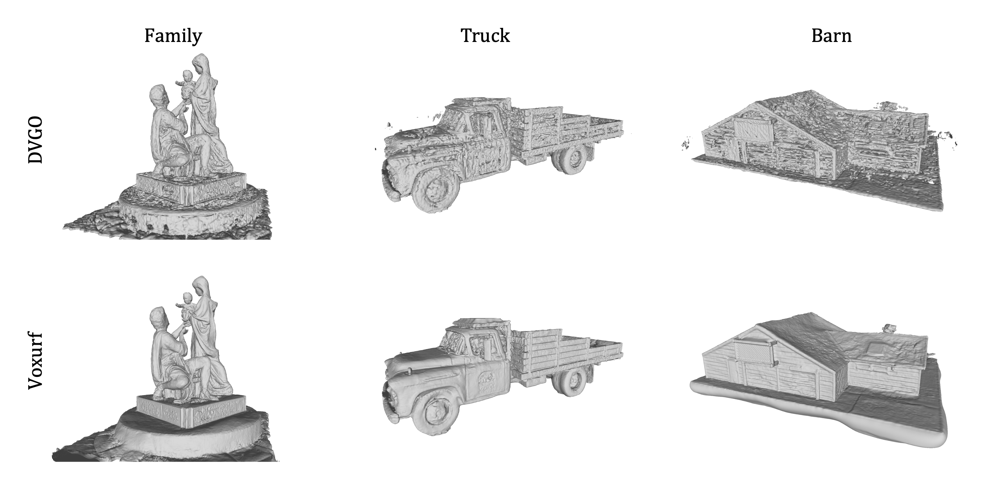
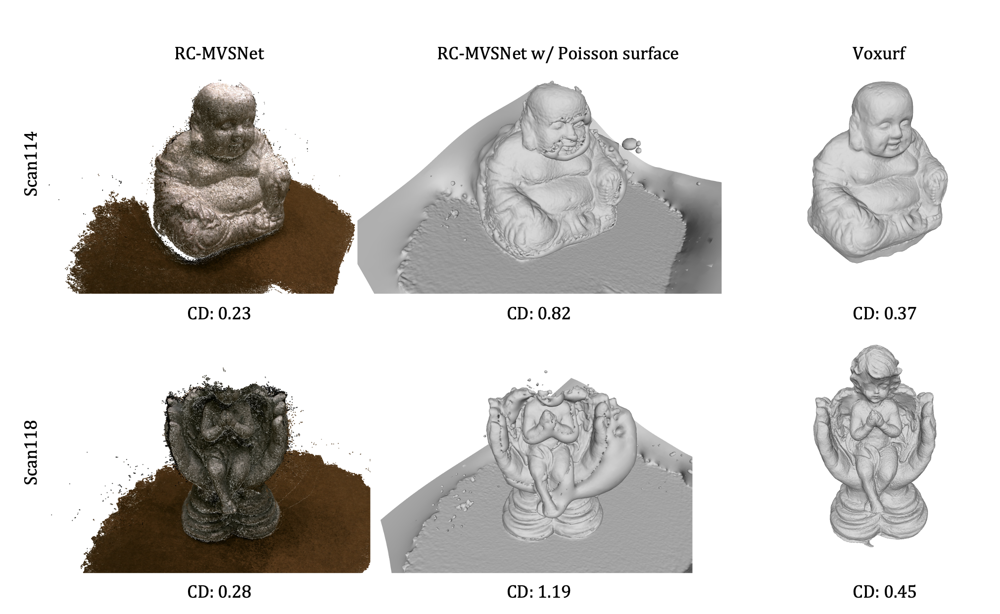
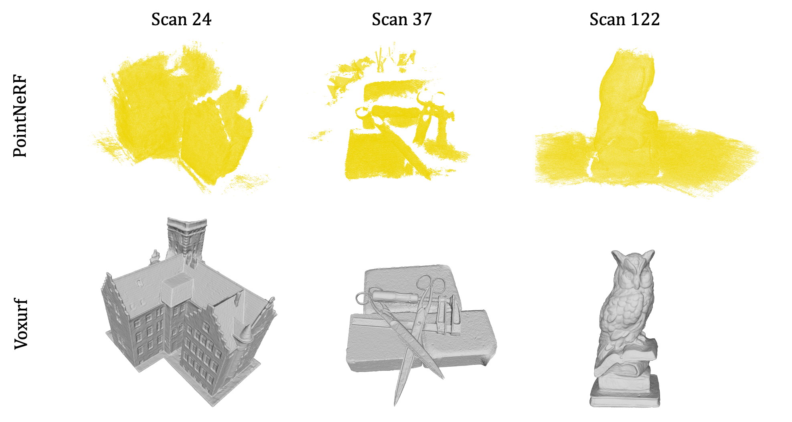

# Paper 495 | More Supplementary Materials 

As suggested by the Author Guide, we will provide some more supplementary materials here during the discussion stage.

### Several qualitative comparisons on scenes from Tanks & Temples.

We will present full comparisons with more baseline methods and more scenes in the final version. 

### Qualitative and quantitative comparisons with the SoTA self-supervised MVS method.

We have carefully surveyed recent approaches of self-supervised MVS methods, and we find RC-MVSNet(Chang et al., 2022) to be one of the most recent and state-of-the-art approaches. Due to the difference in the train-test splits, we temporarily take two examples from the shared test set in DTU for an example as below. It can be seen that the dense point cloud outputs from the MVS network benefit from the lowest Chamfer Distance; however, the surfaces reconstructed from them suffer from a high error with geometric flaws in places where there are holes or noisy points. (We have searched for the best hyper-parameters of Open3D Poisson surface reconstruction tool.) The point-to-mesh stage inevitably introduces additional errors and unsatisfying artifacts to the surface, while our method targets the goal of surface reconstruction and outputs a neat and high-quality surface without any complicated post-processing.
What's more, RC-MVSNet is pre-trained for *90 hours* using *four* NVIDIA RTX 3090 GPUs, which is far more time-consuming than our method. It is not guaranteed to work well on custom data out of the DTU dataset after the pre-training, while our method is optimized case by case, demonstrating a large potential for convinient usage in many applications.

### More results with PointNeRF

| scene           |  24  |  37  |  40  |  55  |  63  |  65  |  69  |  83  |  97  | 105  | 106  | 110  | 114  | 118  | 122  | Avg  |
| --------------- | :--: | :--: | :--: | :--: | :--: | :--: | :--: | :--: | :--: | :--: | :--: | :--: | :--: | :--: | :--: | :--: |
| Neural points   | 0.87 | 2.06 | 1.20 | 1.01 | 1.01 | 1.39 | 0.80 | 1.04 | 0.92 | 0.74 | 0.97 | 0.76 | 0.56 | 0.90 | 1.05 | 1.02 |
| Poisson surface | 2.21 | 4.09 | 2.81 | 2.21 | 2.57 | 2.61 | 2.24 | 2.76 | 2.41 | 2.82 | 2.30 | 2.31 | 1.76 | 2.16 | 2.61 | 2.52 |

